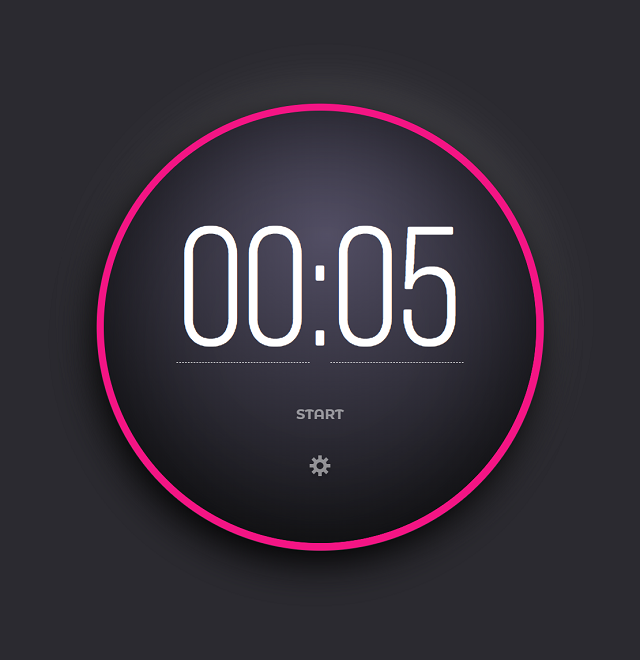

# Pomodoro Timer

This project makes part of Advent of CSS and JavaScript challenges, released by Amy Dutton and James. Which I found to be a great way to learn more and keep practicing.

### Screenshot

### Built with

- [**Visual Studio Code**](https://code.visualstudio.com/)
   - My development environment of choice to work on this project.
- [**HTML5**](https://developer.mozilla.org/en-US/docs/Web/Guide/HTML/HTML5)
    - To get all my elements in and set the project structure.
- [**CSS3**](https://developer.mozilla.org/en-US/docs/Web/CSS/CSS3)
    - To add the styles needed to achieve the desired look .
- [**JavaScript**](https://www.javascript.com/)
    - I've used **JavaScript** to add functionality to the Navigation menu.
- [**Git**](https://git-scm.com/)
    - I've used **Git** as a version control system to regularly add and commit changes made to project in Visual Studio Code, before pushing them to GitHub.
- [**GitHub**](https://github.com/)
    - I've used **GitHub** as a remote repository to push and store the committed changes to my project from Git. I've also used GitHub pages to deploy my website in a live environment.

### Links

- GitHub Repository URL: [https://github.com/Susafp/Pomodoro-Timer.git]
- Live Site URL: [https://susafp.github.io/Pomodoro-Timer/]

### Useful resources and acknowledgments

- [Amy Dutton](https://www.adventofcss.com/) - Advent of CSS
- [Amy Dutton](https://www.adventofjs.com/) - Advent of JavaScript

## Author

- Susana Fragoso Pato - [@Susafp](#)
- Portfolio - [https://susafp.github.io/portfolio/]
- Linkedin - [Susana-fP](https://www.linkedin.com/in/susana-fp/)

